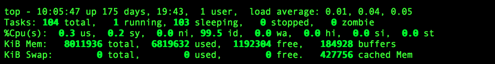

# linx常用命令
* **top命令**

1. load average分别对应于过去1分钟，5分钟，15分钟的负载平均值。
这两个命令只是单纯的反映出负载，linux提供了更为强大，也更为实用的top命令来查看服务器负载。

2. Tasks行展示了目前的进程总数及所处状态，要注意zombie，表示僵尸进程，不为0则表示有进程出现问题

3. Cpu(s)行展示了当前CPU的状态，us表示用户进程占用CPU比例，sy表示内核进程占用CPU比例，id表示空闲CPU百分比，wa表示IO等待所占用的CPU时间的百分比。wa占用超过30%则表示IO压力很大。

4. Mem行展示了当前内存的状态，total是总的内存大小，userd是已使用的，free是剩余的，buffers是目录缓存。
Swap行同Mem行，cached表示缓存，用户已打开的文件。如果Swap的used很高，则表示系统内存不足。

5. 在top命令下，按1，则可以展示出服务器有多少CPU，及每个CPU的使用情况，服务器的合理负载是CPU核数*2

6. 按shift + "c"，则将进程按照CPU使用率从大到小排序，按shift+"p"，则将进程按照内存使用率从大到小排序，很容易能够定位出哪些服务占用了较高的CPU和内存。
* **切换目录**
1. cd   ~       当前用户主目录
2. cd   /        根目录
3. cd   -        上一次访问的目录
4. cd   ..       上一级目录
5. cd            当前用户主目录
* **创建目录**
1. pwd:显示当前工作目录
2. mkdir: 创建目录 （mkdir   a :当前目录下创建文件夹a）
* **文件浏览**
1. cat   文件名：显示指定文件的所有内容（用于文件内容少的情况）
2. more  文件名：分页显示文件内容，还支持直接跳转行等功能（用于文件内容多的情况）
          Enter ：向下n行，需要定义。默认为1行
          空格键：向下滚动一屏  或 Ctrl+F
          B    返回上一屏  或Ctrl+B
          q   退出more
* **tail命令**  
用来显示指定文件末尾内容，不指定文件时，作为输入信息进行处理。常用查看日志文件。  自己常用 tail -100f xxx.log命令
          tail[必要参数][选择参数][文件]
          -n<行数> 显示行数
          -f 循环读取
* **vi命令**
1. vim  文件名   ：进入一般模式（不能输入）
2. 按下 i 从一般模式，进入到插入模式
3. 按下esc从插入模式，退出到一般模式
4. 在一般模式下，输入:wq,退出编辑
* **管道-grep命令**
      功能：用于过滤/搜索特定字符。可使用正则表达式 能多种命令配合使用。
      格式：grep [option] pattern [file]       grep   参数  过滤条件   文件        （-i 或 --ignore-case        忽略字符大小写的差别）
      例如：grep   -i   one  /root/1.txt      显示root目录下的1.txt文件中含有one字符的一行数据（忽略大小写）   
      格式：其他命令 | grep  参数  过滤条件
      例如：cat   /root/1.txt  |  grep  -i  one     在cat命令输出结果基础上，进行过滤
* **系统命令**
1. ps命令
      任务管理器：ps  -ef        查看当前所有进程（包括执行ps命令的那个时刻进程信息）
      格式：ps [参数]
      -e  此参数的效果和指定“A”参数相同，显示所有程序
      -f  显示UID,PPIP,C与STIME栏位
      例如：ps -ef  |  grep -i mysql     过滤出mysql这个进程

2. kill命令
      kill功能：删除执行中的程序或工作
      语法：kill[参数][程序]
      -l<信息编号>       若不加<信息编号>选项，则-l参数会列出全部的信息名称。
      kill  -9  ：表示强制终止
      格式：kill    -9    pid
      可先通过ps -ef 查找出所要删除的进程pid，再通过kill -9 pid 终止进程
3. ifconfig命令
      功能：显示网络设备
      格式：ping  主机名或ip地址    （按ctrl+c停止ping）
      9.备份压缩：tar命令
4. tar功能：文件备份压缩
        格式：tar      参数       压缩后的文件名      被压缩的文件名
             tar      参数       被解压的文件名      -C  指定目录            （如果省略 -C 指定目录，则解压到当前文件夹）
             -c 建立一个压缩文件的参数指令（create）--压缩
             -x 解开一个压缩文件的参数指令（extract）--解压
             -z 是否需要用gzip压缩
             -v 压缩的过程中显示文件（verbose）
             -f 使用档名，在f之后要立即接档名（file）
             常用解压参数组合：zxvf
             常用压缩参数组合：zcvf
             例如：
             tar  -zcvf  /root/1.tar   /root/a     将root目录下的a文件夹压缩成1.tar,放在root目录下。
             tar  -zxvf  ./1.tar        将当前目录下的1.tar文件解压缩
             [注]：如果后缀名为.tar.gz的压缩包用-zxvf   如果后缀名为.tar的压缩包用-xvf
* **文件权限：chmod命令**  
          chmod功能：变更文件或目录的权限
          语法：chmod [参数][<权限范围><符号><权限代号>]
          -R  或 --recursive   递归处理，将指定目录下的所有文件及子目录一并处理
          --权限范围的表示法如下：
          u：User  即文件或目录的拥有者
          g：Group 即文件或目录的所属群组
          o：Other  除了文件或目录拥有者或所属群组之外，其他用户皆属于这个范围
          a：All        即全部的用户，包含拥有者，所属群组及其他用户。
          --符号
          + 添加权限
          - 取消权限
          -- 有关权限代号的部分
          r：读取权限，数字代号为“4”
          w：写入权限，数字代号为“2”
          x：执行或切换权限，数字代号为“1”
          - ：不具任何权限，数字代号为“0”
          777 ：所有权限
          [注]：3=1+2（wx）   5=4+1(rx)
          例如：
          chmod    u-rwx   xxx    取消xxx目录的用户“读写执行”权限
          chmod    g-rwx   xxx    取消xxx目录的组“读写执行”权限
          chmod    777      xxx    给xxx目录添加所有权限 
* **关机重启**
Linux centos 重启命令：reboot
Linux centos 关机命令：halt
