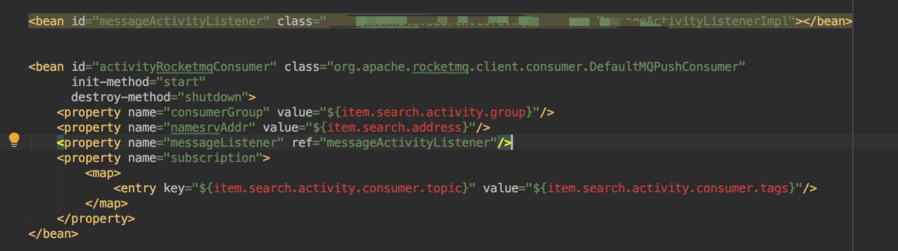
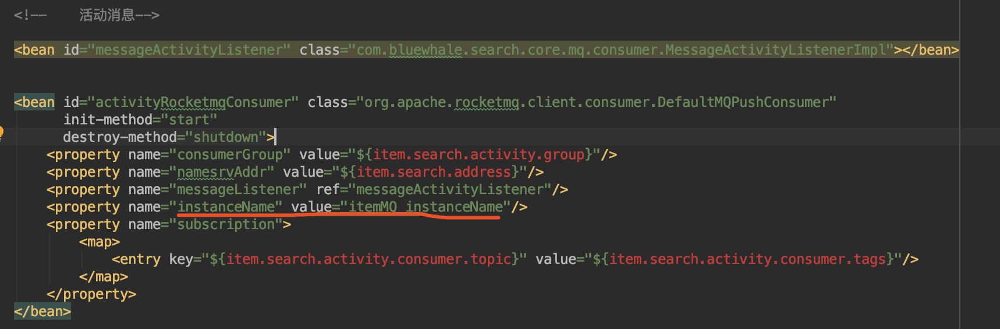

# 背景

> 接手一个商品搜索ES项目，需要把活动内容写入到ES里面，采用了MQ的方式，当商品参加活动的时候，接收活动的信息，该项目里面已经配置了一个MQ，想着只需要新建一个tags就好了，然后接收MQ信息，维护ES

# 开发

> 新建两个tag，一个是activity_add_tag,一个是actvitiy_cancel_tag,通过然后分别处理不同的消息，去更新ES

# 问题

> 开发环境：一切OK
> 提交测试：
> 问题：发送消息MQ activity_add_tag,一个是actvitiy_cancel_tag成功，但是消费端始终没有接收到MQ，但是有时候又能接收到，神奇事件。在MQ控制台能看到，group中trackType状态为：NOT_CONSUME_YET，
> 由于该项目下面有一个订阅组名 search-group，初步了解，该search-group是接收数据库监听的binlog的MQ。
>
> 解决办法：重新定义一个consumer，并新建自己的group，不用项目里面存在的search-group
> 改完后，重新提测，OK一切正常

### 正式环境：

> **问题**：MQ控制台新建group后，出现org.apache.rocketmq.client.exception.MQClientException: CODE: 17 DESC: No topic route info in name server for the topic: %RETRY%activity-prod-group See http://rocketmq.apache.org/docs/faq/ for further details 错误，这是什么错，懵逼了，测试环境没有啊，开发环境也没出现过。然后各种找问题，为啥我新建的group不能连订阅topic里面的消息。
> **解决**：由于项目里面已经存在了一个MQ，他们的MQ地址是数据地址的MQ，然后我天真的以为业务开发地址跟他们也用的一样，所以我在业务开发的后台新建的MQ的group打死都订阅不到topic的信息。更改自己业务的MQ地址，启动。 你以为这就正常了么，你太天真了，现在换了一个错误
> Not found the consumer group consume stats, because return offset table is empty, maybe the consumer
> ？？？ MMP，这是怎么回事，我天真的以为 链接地址配对了，group也新建了，啥都可以了，为啥还是订阅不了消息，
>  这是代码配置。
>

**分析原因**

* 该项目里面存在两个MQ环境了

* 一个项目里面需要新建两个MQ的环境链接

  > 解决：
  > 
  > 加了一个instanceName的值 